# Newspack Collections

This directory contains the core implementation of the Newspack Collections system, which provides a structured way to manage and organize content collections in WordPress.

## Usage

### Enabling the module

1. Navigate to Newspack > Settings in the admin dashboard.
2. Select the Collections tab.
3. Click on the toggle to enable the Collections module.

### Creating a collection

1. Navigate to the Collections menu in the WordPress admin interface sidebar or use the REST API to create a new collection post.
2. Set the meta fields in the post editor using the fields in the Collection Details panel.
3. Set the collection order using the WordPress core functionality.

### Assigning posts to a collection

1. Use the WordPress admin interface or REST API to create or edit a post.
2. Select the collection and section from the post editor dropdowns.
3. Set the order of the post in the collection using the field in the Collection Settings panel.
3. Save the post.

### Creating a section

1. Navigate to Collections > Sections in the WordPress admin interface sidebar or use the REST API to create a new section term.
2. Set the order via the form in the section editor or Quick Edit menu.

### Creating a category

1. Navigate to Collections > Categories in the WordPress admin interface sidebar or use the REST API to create a new category term.

## System overview

The Collections system is built around a custom post type (`newspack_collection`) and includes several key components for managing collections, their metadata, taxonomies, and synchronization.

## Backend components

### 1. Collection custom post type ([`class-post-type.php`](class-post-type.php))
- Defined as a `newspack_collection` CPT.
- Supports: `title`, `editor`, `thumbnail`, `custom-fields`, and `page-attributes`.
- Includes custom ordering functionality via `menu_order`.
- Provides admin interface customizations.

### 2. Collection post meta fields ([`class-collection-meta.php`](class-collection-meta.php))

The following table details all available meta fields for collections:

| Meta Field | Type | Description | Format |
|------------|------|-------------|---------|
| `newspack_collection_file_attachment` | Integer | For uploaded files | Attachment ID |
| `newspack_collection_file_link` | String | External file URL | Valid URL |
| `newspack_collection_volume` | String | Collection volume information | Text |
| `newspack_collection_issue_number` | String | Issue number | Text |
| `newspack_collection_issue_date` | String | Issue date | Text (e.g., "Spring 2025") |
| `newspack_collection_subscribe_link` | String | Subscription URL | Valid URL |
| `newspack_collection_order_link` | String | Order URL | Valid URL |

All meta fields are:
- REST API enabled
- Access-controlled
- Sanitized

### 3. Data management ([`class-collections-data.php`](class-collections-data.php))
- Manages JavaScript data localization.
- Provides a common interface for adding/retrieving collection data dynamically.
- Handles script enqueuing for rendering the localized data in a single place.

### 4. Taxonomies
The system includes multiple taxonomy classes for organizing collections:

#### Collection category taxonomy ([`class-collection-category-taxonomy.php`](class-collection-category-taxonomy.php))
- Taxonomy name: `newspack_collection_category`.
- Non-hierarchical taxonomy for categorizing collections.
- Similar to WordPress post categories.

#### Collection section taxonomy ([`class-collection-section-taxonomy.php`](class-collection-section-taxonomy.php))
- Taxonomy name: `newspack_collection_section`.
- Non-hierarchical taxonomy for categorizing post into sections.
- Similar to WordPress tags.
- Adds a new "Section" column to the post list.
- Order is stored in the term meta `newspack_collection_section_order`.

#### Collection taxonomy ([`class-collection-taxonomy.php`](class-collection-taxonomy.php))
- Taxonomy name: `newspack_collection_taxonomy`.
- Special internal taxonomy (`newspack_collection_taxonomy`) for associating collections with posts.
- It's a copy of the collection post title and slug to allow regular posts to be tagged with collections.
- Not publicly queryable.
- Hidden from the admin UI.
- Adds a new "Collection" column to the post list.
- Terms can be deactivated via an internal `_newspack_collection_inactive` term meta. Used when trashing posts, as terms don't manage status.

### 5. Synchronization ([`class-sync.php`](class-sync.php))
- Handles synchronization of collection posts and collection terms.
- Ensures data consistency across objects using a two-way meta relationship:
  - For posts, link via `_newspack_collection_term_id` internal post meta.
  - For terms, link via `_newspack_collection_post_id` internal term meta.
- Manages post and terms lifecycle events using the following logic:
```
Post created   -> Term created and linked (copy title and slug)
Post edited    -> Term edited (copy title and slug)
Post deleted   -> Term deleted
Post trashed   -> Term marked as inactive (via term meta)
Post untrashed -> Term marked as active (via term meta)
Term created   -> Post created as draft and linked
Term edited    -> Post edited (copy title and slug)
Term deleted   -> Post trashed (to prevent data loss)
```

### 6. Post meta fields ([`class-post-meta.php`](class-post-meta.php))
- Meta key: `newspack_order_in_collection`.
- Used for storing the post order in collection.

## Frontend components

The collections system includes several frontend components that handle the admin interface:

### Admin JavaScript modules

Located in [`src/collections/admin/`](src/collections/admin/):

| File | Purpose |
|------|---------|
| [`collection-meta-panel.js`](src/collections/admin/collection-meta-panel.js) | Main React component for the collection editor meta panel. Handles collection metadata editing. |
| [`collection-meta-upload-field.js`](src/collections/admin/collection-meta-upload-field.js) | React component for handling file uploads in the collection editor. Manages the file attachment meta field. |
| [`post-meta-panel.js`](src/collections/admin/post-meta-panel.js) | React component for the post editor meta panel. Handles post meta fields editing. |
| [`section-taxonomy.js`](src/collections/admin/section-taxonomy.js) | JavaScript component for managing section taxonomy terms ordering in the admin interface. |
| [`index.js`](src/collections/admin/index.js) | Entry point for the admin JavaScript bundle. |

### Admin styles

| File | Purpose |
|------|---------|
| [`collection-meta-panel.scss`](src/collections/admin/collection-meta-panel.scss) | Styles for the collection editor meta panel components. |

### Integration

The frontend components are integrated into WordPress through:

1. **Script Loading**
   - Enqueued via `Collections::enqueue_admin_scripts()` if the Collections module is enabled.
   - Bundle: `dist/collections-admin.js`

2. **Style Loading**
   - Enqueued via `Collections::enqueue_admin_styles()` if the Collections module is enabled.
   - Bundle: `dist/collections-admin.css`

3. **Data Localization**
   - Collection data is localized via `Collections_Data::localize_data()`.
   - Available globally as `newspackCollections` window object.
   - Frontend receives:
     - Collection post type configuration.
     - Meta field definitions.
     - Taxonomy data.

4. **REST API Integration**
   - All components use the WordPress REST API.
   - Consumes endpoints for:
     - Collection CRUD operations.
     - Meta field management.
     - Taxonomy term management.
     - Attachment uploads.
     - Settings management.

## File structure

```
newspack-plugin/
├── includes/
│   ├── collections/
│   │   ├── class-collection-category-taxonomy.php
│   │   ├── class-collection-meta.php 
│   │   ├── class-collection-section-taxonomy.php
│   │   ├── class-collection-taxonomy.php
│   │   ├── class-collections-data.php
│   │   ├── class-post-meta.php
│   │   ├── class-post-type.php
│   │   ├── class-sync.php
│   │   ├── README.md
│   │   └── traits/
│   │       └── hook-management-trait.php
│   ├── optional-modules/
│   │   └── class-collections.php
│   └── wizards/
│       └── newspack/
│           └── class-collections-section.php
├── src/
│   └── collections/
│       └── admin/
│           ├── collection-meta-panel.js
│           ├── collection-meta-panel.scss
│           ├── collection-meta-upload-field.js
│           ├── index.js
│           ├── post-meta-panel.js
│           └── section-taxonomy.js
└── tests/
    └── unit-tests/
        └── collections/
            ├── class-test-collection-category-taxonomy.php
            ├── class-test-collection-meta.php
            ├── class-test-collection-section-taxonomy.php
            ├── class-test-collection-taxonomy.php
            ├── class-test-collections-data.php
            ├── class-test-collections-section.php
            ├── class-test-collections.php
            ├── class-test-post-meta.php
            ├── class-test-post-type.php
            ├── class-test-sync.php
            └── traits/
                └── trait-collections-test.php
```

## Data model

```mermaid
erDiagram
    %% Post Types
    wp_posts ||--o{ newspack_collection : "post_type = 'newspack_collection'"
    wp_posts ||--o{ post : "post_type = 'post'"
    post {
        string post_type "post"
    }
    wp_posts {
        int menu_order
    }
    wp_posts ||--o{ wp_postmeta : "has meta"
    wp_posts ||--o{ wp_term_relationships : "has terms"

    %% Collection Meta
    wp_postmeta ||--|| newspack_collection_meta : "meta_key LIKE '%newspack_collection_%'"
    newspack_collection_meta {
        string meta_key "_newspack_collection_term_id"
        string meta_key "newspack_collection_file_attachment"
        string meta_key "newspack_collection_file_link"
        string meta_key "newspack_collection_volume"
        string meta_key "newspack_collection_issue_number"
        string meta_key "newspack_collection_issue_date"
        string meta_key "newspack_collection_subscribe_link"
        string meta_key "newspack_collection_order_link"
    }

    %% Post Collection Meta (for assigned posts)
    post_collection_meta {
        string meta_key "newspack_order_in_collection"
    }
    wp_postmeta ||--|| post_collection_meta : "meta for assigned posts"

    %% Taxonomies
    wp_terms ||--o{ wp_term_taxonomy : "has taxonomy"
    wp_term_taxonomy ||--o{ wp_term_relationships : "has relationships"

    %% Collection Taxonomy
    wp_term_taxonomy ||--|| newspack_collection_taxonomy : "taxonomy = 'newspack_collection_taxonomy'"
    newspack_collection_taxonomy {
        string taxonomy "newspack_collection_taxonomy"
        %% Term meta for status and sync are stored in wp_termmeta
    }

    %% Section Taxonomy
    wp_term_taxonomy ||--|| newspack_collection_section : "taxonomy = 'newspack_collection_section'"
    newspack_collection_section {
        string taxonomy "newspack_collection_section"
        string term_meta "newspack_collection_section_order"
    }

    %% Category Taxonomy
    wp_term_taxonomy ||--|| newspack_collection_category : "taxonomy = 'newspack_collection_category'"
    newspack_collection_category {
        string taxonomy "newspack_collection_category"
    }

    %% Term Meta
    wp_terms ||--o{ wp_termmeta : "has term meta"
    wp_termmeta ||--|| newspack_collection_term_meta : "term meta fields"
    newspack_collection_term_meta {
        string meta_key "_newspack_collection_post_id"
        string meta_key "_newspack_collection_inactive"
    }

    %% Post Meta for Terms
    wp_postmeta ||--|| newspack_collection_term_meta : "meta_key = '_newspack_collection_term_id'"
    %% newspack_collection_term_meta already defined above

    %% Legend
    classDef postType fill:#f9f,stroke:#333,stroke-width:2px
    classDef taxonomy fill:#bbf,stroke:#333,stroke-width:2px
    classDef meta fill:#bfb,stroke:#333,stroke-width:2px
    
    class wp_posts postType
    class wp_term_taxonomy taxonomy
    class wp_postmeta,wp_termmeta meta
```


