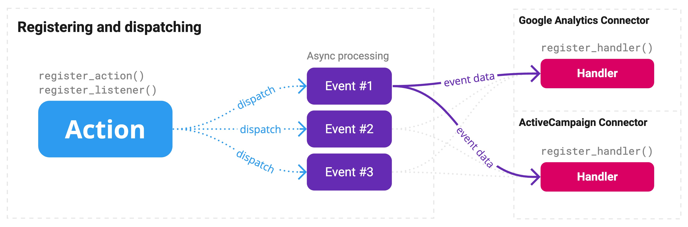

# Newspack Data Events

## A tool for non-blocking dispatch of data events to registered handlers.

The purpose of this tool is to unify the strategy for sending reader activity data to third-party services, focused primarily on analytics, ESPs, and CRMs.



Once an action is registered, dispatches can be called with an arbitrary payload. These events will call the registered handlers. Handlers should be created and registered by the third-party integration/connector.

## Important Technical Notes

The non-blocking strategy implemented in the Data Events dispatch is inspired by [TechCrunch's `wp-async-task`](https://github.com/techcrunch/wp-async-task) and uses an HTTP request to trigger the handlers.

If [WooCommerce's ActionScheduler](https://actionscheduler.org/) is available, the dispatch of a data event will be handled by the tool's `as_enqueue_async_action()`. It'll also be the case for the processing of [webhook](class-webhooks.php) requests, which will be scheduled through `as_schedule_single_action()`. This is the default behavior when WooCommerce is installed and active.

If not using ActionScheduler, it's recommended to use a different strategy for running WP-Cron so you can ensure that webhook requests are processed in a timely fashion and without affecting page load. Read more at [Hooking WP-Cron Into The System Task Scheduler](https://developer.wordpress.org/plugins/cron/hooking-wp-cron-into-the-system-task-scheduler/).

---

## Newspack Core Actions

These events are registered by the Newspack Plugin and available by default.

### `reader_registered`

When a reader registers.

| Name       | Type      |
| ---------- | --------- |
| `user_id`  | `integer` |
| `email`    | `string`  |
| `metadata` | `array`   |

### `reader_logged_in`

When a reader authenticates.

| Name      | Type      |
| --------- | --------- |
| `user_id` | `integer` |
| `email`   | `string`  |

### `reader_verified`

When a reader verifies their email address.

| Name      | Type      |
| --------- | --------- |
| `user_id` | `integer` |
| `email`   | `string`  |

### `newsletter_subscribed`

When a reader subscribes to newsletter lists from Newspack Newsletters subscription.

| Name       | Type       |
| ---------- | ---------- |
| `user_id`  | `integer`  |
| `email`    | `string`   |
| `provider` | `string`   |
| `contact`  | `array`    |
| `lists`    | `string[]` |

### `newsletter_updated`

When a reader updates their lists subscription from Newspack Newsletters.

| Name            | Type       |
| --------------- | ---------- |
| `user_id`       | `integer`  |
| `email`         | `string`   |
| `provider`      | `string`   |
| `email`         | `string`   |
| `lists_added`   | `string[]` |
| `lists_removed` | `string[]` |

### `donation_new`

When there's a new donation, either through Stripe or Newspack (WooCommerce) platforms.

| Name            | Type     |
| --------------- | -------- |
| `user_id`       | `int`    |
| `email`         | `string` |
| `amount`        | `float`  |
| `currency`      | `string` |
| `recurrence`    | `string` |
| `platform`      | `string` |
| `platform_data` | `array`  |

### `donation_subscription_new`

When there's a new WooCommerce Subscription. This action does not replace the `donation_new` that create the subscription.

| Name            | Type     |
| --------------- | -------- |
| `user_id`       | `int`    |
| `email`         | `string` |
| `amount`        | `float`  |
| `currency`      | `string` |
| `recurrence`    | `string` |
| `platform`      | `string` |
| `platform_data` | `array`  |

### `donation_subscription_cancelled`

When a WooCommerce Subscription is cancelled.

| Name              | Type     |
| ----------------- | -------- |
| `user_id`         | `int`    |
| `email`           | `string` |
| `subscription_id` | `int`    |
| `amount`          | `float`  |
| `currency`        | `string` |
| `recurrence`      | `string` |
| `platform`        | `string` |

### `donation_subscription_changed`

When a WooCommerce Subscription status changes.

| Name              | Type     |
| ----------------- | -------- |
| `user_id`         | `int`    |
| `email`           | `string` |
| `subscription_id` | `int`    |
| `status_before`   | `string` |
| `status_after`    | `string` |
| `amount`          | `float`  |
| `currency`        | `string` |
| `recurrence`      | `string` |
| `platform`        | `string` |

## Registering a new action

To dispatch an event, an action must first be registered with the following:

```php
Newspack\Data_Events::register_action( 'action_name' );
```

## Dispatching

Once registered, an array with arbitrary payload can be dispatched:

```php
$data          = [ "test" => "data" ];
$use_client_id = true;
Newspack\Data_Events::dispatch( 'action_name', $data, $use_client_id );
```

The use of client ID, which is `true` by default, will send the `Reader_Activation::get_client_id();` as part of the data event payload. This client ID is pulled from the session's `newspack-cid` cookie. Most data events are expected to be user actions and third parties might make use of having an ID that groups anonymous sessions.

## Listeners

Listeners are a shortcut to dispatch an action on a [WordPress hook](https://developer.wordpress.org/plugins/hooks/). Example:

```php
$hook_name   = 'woocommerce_checkout_order_processed';
$action_name = 'order_processed';
Newspack\Data_Events::register_listener( $hook_name, $action_name );
```

The action is registered with the listener, so there's no need to register the action in this case.

With this listener, every registered handler will receive the `order_processed` data event.

A listener can receive a 3rd argument that can be either `callable`, which receives the hook's data for filtering, or `string[]`, which will be used to map the hook's arguments for an associative array.

Example with a `callable` to process/filter the data from the WP hook:

```php
Newspack\Data_Events::register_listener(
	'woocommerce_checkout_order_processed',
	'order_processed',
	function ( $data ) {
		// Parse data
		return $data;
	}
);
```

Example with an array of strings to map the hook's arguments:

```php
Newspack\Data_Events::register_listener(
	'newspack_newsletters_add_contact',
	'newsletter_subscribed',
	[ 'provider', 'contact', 'lists', 'result' ]
);
```

## Handlers

Callbacks triggered by the dispatch of an action or a listener. Think of it as the actual connector/integration to the third-party, whilst the action/dispatch is the directory of available data provided by Newspack.

An action handler receives the following arguments:

| Argument    | Type     | Description                                       |
| ----------- | -------- | ------------------------------------------------- |
| `timestamp` | `int`    | The timestamp in which the action was dispatched. |
| `data`      | `array`  | The action payload.                               |
| `client_id` | `string` | The client's `newspack-cid`, if available.        |

Registering a handler:

```php
// Action handler
function my_action_handler( $timestamp, $data, $client_id ) {
	// Send data to a third-party.
}
Newspack\Data_Events::register_handler( 'my_action_handler', 'my_action' );

// Global handler, to be called on every data event
function my_global_handler( $action_name, $timestamp, $data, $client_id ) {
	// Do some global analytics.
}
Newspack\Data_Events::register_handler( 'my_global_handler' );
```

As you can see in the example above, if the second argument is empty the handler is treated as a **global handler** and will be called for every action dispatch. This is useful for analytics/tracking integrations, which every event should be logged with a generic/abstract approach.

In this case, the first argument sent to the handler is the action name, followed by the other arguments.

Each handler caller is contained in a `try...catch` block so a fatal error caused by a handler never disrupts other handlers.
